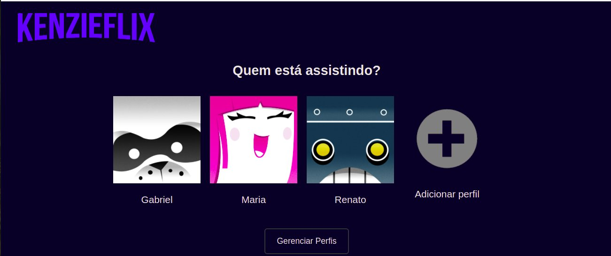

# Estilizar um Layout de uma plataforma de streaming

Este projeto foi desenvolvido para aprimorar os conhecimentos em HTML5 e CSS3 no curso de Desenvolvimento Full Stack da **Kenzie Academy Brasil**

### Linguagens e propriedades utilizadas

- O conceito de **Flexbox** para posicionar cada box de usuário
- HTML5
- CSS3
- Conceito de hover e active
- Design responsivo
- Media queries

### Layout do projeto

### Autor

**Giuliane Camilo**

LinkedIn: https://www.linkedin.com/in/giulianecamilo/

